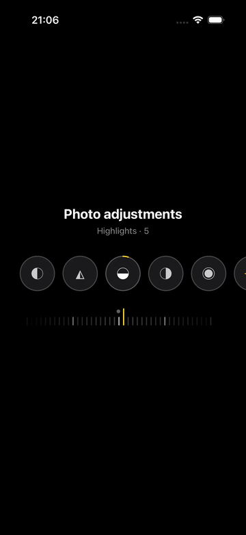

# Dial slider

Minimal Expo app demoing a single component: `DialSlider`.

## Demo

[]

Click the preview to open the original video.

## `DialSlider`

Photo-style adjustment control. The caller owns the tool list (e.g.
`PHOTO_PRESETS`); its length decides chrome:

- **1 preset** → single centered tool + shared ruler
- **N presets** → horizontal strip + independent values per tool + shared ruler

```tsx
import { DialSlider, type DialPreset } from '@/components/dial-slider';

const PHOTO_PRESETS: readonly DialPreset[] = [
  {
    id: 'exposure',
    label: 'Exposure',
    icon: ({ selected }) => (
      <MyExposureIcon color={selected ? '#fff' : '#aaa'} />
    ),
    minValue: -100,
    maxValue: 100,
    initialValue: 0,
  },
];

<DialSlider
  presets={PHOTO_PRESETS}
  initialPresetId="exposure"
  onPresetChange={(presetId, value) => {}}
  onValueChange={(presetId, value, allValues) => {}}
/>
```

## Layout

```text
src/app/                 # single demo screen
src/components/dial-slider/
  DialSlider.tsx
  preset/                # preset viewport, button, progress ring
  ruler/                 # ruler shell, ticks, origin, edge fades
  constants.ts
  types.ts
  index.ts
src/hooks/
  useDialRulerMotion.ts   # gesture + shared-value synchronization
src/utils/dial-slider/
  dial-math.ts
  preset-config.ts
  preset-state.ts
  ring-math.ts
tests/
```

## Scripts

```bash
bun install
bun start
bun run test
bun run lint
```
